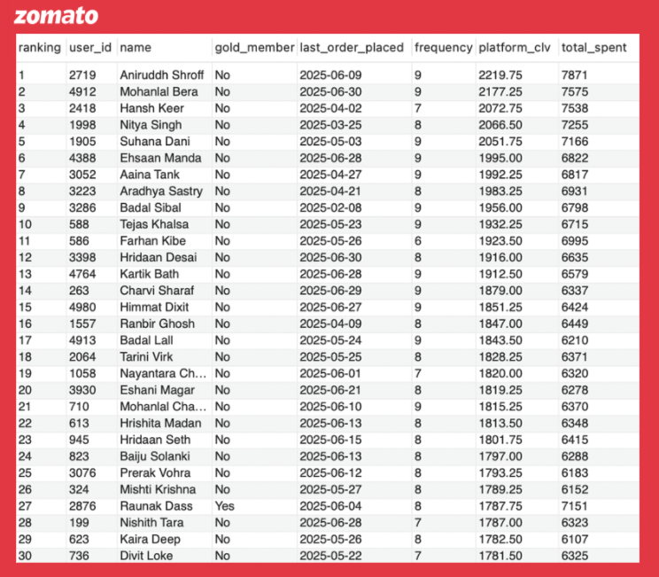

# Zomato Data Analysis | SQL | July 2024 - June 2025

Table of Contents

- [Project Background](#project-background)
- [Data Description](#data-description)
    - [Key SQL Functions, Assumptions & Limitations](#key-sql-functions-assumptions--limitations)
- [Executive Summary](#executive-summary)
- [In-Depth Analysis](#in-depth-analysis)
    - [Business Performance, Growth & Market Trends](#business-performance-growth--market-trends)
    - [Operational Efficiency, UX Funnel & Delivery Optimisation](#operational-efficiency-ux-funnel--delivery-optimisation)
    - [Customer, Product & Restaurant Partner Level Analytics](#customer-product--restaurant-partner-level-analytics)
- [Recommendations](#recommendations)

***

## Project Background

Zomato is an Indian leader in online food ordering and delivery services, with an estimated 58% market share and an exponential growth record in recent years. While the acquisition of Blinkit accelerated quick-commerce expansion, recent trends indicate a revenue slowdown in core food delivery in FY25 and a profitability dip in Q1 FY26. The delisting of 19,000 restaurants, along with a shift in partner preferences toward Swiggy and ONDC-based platforms such as Digihaat due to rising commission rates, has further intensified these challenges.

This project uses a simulated Zomato dataset spanning July 2024 to June 2025, leveraging SQL-driven analysis to uncover key insights. The analysis covers business performance and market trends, operational efficiency and UX funnel metrics, as well as customer, product, and partner analytics to deepen understanding and identify growth opportunities.

## Data Description

The dataset is modeled as a relational schema with multiple fact tables such as `app_sessions`, `app_pageviews`, `orders`, `order_items`, and `order_items_cancelled`, and dimension tables including `users`, `menu`, `restaurants`, and `delivery_agents`.

- `app_sessions`: Contains all sessions on the Zomato app, including UTM source and device type for measuring app performance and evaluating traffic sources.
- `app_pageviews`: Captures all pages viewed within a specific app session, enabling UX funnel analysis and abandonment rate calculations.
- `orders`: Records each order placed, including order time, payment mode, delivery fee paid, and total price to analyse purchase behaviour trends and overall business performance.
- `order_items`: Lists all items in each order, including the primary product flag and price per item for cart size analysis and cross-sell optimisation.
- `order_items_cancelled`: Lists all cancelled order items, including the Zomato food rescue feature flag and refund amount to evaluate total loss, avoided loss, and cancellation characteristics.
- `users`: Contains demographic and Zomato Gold membership details for registered customers to support regional business performance categorisation and RFM analysis.
- `menu`: Contains all listed food items with associated restaurant ID, price, and item name to support combo order pairing analysis and SKU-level tracking.
- `restaurants`: Includes all listed restaurants with licence number, cuisine, cost for two, ratings, and review counts for restaurant-level business measurement and identification of top-rated partners.
- `delivery_agents`: Contains delivery partner details, including demographic and location data for segmenting delivery performance, operational efficiency, and activity rates.

## Key SQL Functions, Assumptions & Limitations

The project utilises a wide range of SQL functions to deliver a comprehensive, in-depth analysis. This includes window functions, common table expressions (CTEs), subqueries, temporary tables and views, date and time functions, aggregations including conditional aggregations, joins, mathematical functions, and text and value handling. These techniques enabled drilling down into the dataset and producing highly detailed insights. 

The analysis is based on the following key assumptions and data handling considerations to ensure consistency and clarity in results:

- A fixed commission rate of 25% is assumed for gross platform revenue calculations. Orders availed under the Food Rescue feature are assumed to be paid at 50% of the total price plus delivery fees, with the remaining loss borne by Zomato. For cancelled orders without rescue, it is assumed that Zomato bears the entire loss.

- The `app_pageviews` table follows a simplified journey of `/home` → `/search` → `/restaurants` → `/menu` → `/cart` → `/thankyou` page (Order Confirmation), although in practice the ordering path may vary. For the purposes of this analysis, each session is limited to producing at most one order, with no multi-restaurant orders.

- The `orders` table contains delivery time for cancelled orders, which in these cases represents the cancellation time. All `total_price` / `price` fields in `orders`, `order_items`, `order_items_cancelled`, and `menu` are inclusive of GST and discounts. The `amount_of_refund` in `order_items_cancelled` is equal to the total price excluding the delivery fee; therefore, the `net_orders` view was created for accurate loss and revenue analysis.

Note: As this dataset is synthetic and intended for portfolio demonstration, certain values may not reflect Zomato’s actual business metrics. The data covers the period from July 2024 to June 2025, with incomplete July 2025 figures shown as running totals. 

## Executive Summary

Zomato, over the period from July 2024 to June 2025, recorded its highest city-level contributions from Delhi and Hyderabad, jointly generating ₹1.4 million+ in gross revenue. Hyderabad also claimed 5 of the top 10 highest rated listed restaurants. Bangalore produced the top commission-contributing restaurant yet ranked last in overall order and revenue generation, while Kolkata and Mumbai struggled with over ₹20K in combined losses from cancellations, coupled with the lowest AOV (₹198.85 for Kolkata) and conversion rates (73.87% for Mumbai).

February 2025 marked the sharpest dip (-17.15% orders, -14.68% revenue), followed by a rebound that saw a rolling 3-month revenue peak at ₹780.0K by the end of Q1 FY26. The recently launched Food-Rescue feature avoided 29.18% of would-be losses post launch. The mobile app drove over 70% of sessions, with paid traffic generating the highest orders, while organic and brand-driven channels (email and notifications) delivered the highest revenue per session (₹150+ each).

The UX funnel showed a 12%+ abandonment rate at checkout. Mega and high-value orders dominated (8,708 orders), with Zomato Wallet usage steady at 24% across all order values. Single-item orders were the costliest to serve, with a delivery fee share of GMV at 13.46% compared to 2.82% for big carts, while the average delivery fee stood at ₹32.5+ across all cart sizes (inclusive of ₹0 fees for Gold members on orders above ₹199). Engagement peaked between 8-10 PM, yet weekends did not deliver the expected surge.

Non-Gold members dominated the CLV rankings, with the highest platform CLV at ₹2,219.75 and total spent of ₹7,871, and only one Gold member in the top 30, highlighting the need for targeted Gold offers to high-value customers. Occasional orders with medium or low engagement (2,928 collectively) made up the largest user segment, while 707 single-order low-engagement users posed a churn risk requiring retention action. 

Operational analysis also revealed that 11.99% of riders (120 in total) were under-utilised, ranking in the bottom 25% for completed deliveries, pointing to untapped capacity and inefficiencies in rider scheduling.

## In-Depth Analysis

## Business Performance, Growth & Market Trends

- Delhi and Hyderabad lead platform revenue at ₹523.3K and ₹520.0K respectively, with Delhi also topping in conversion rate (75.24%) and AOV (₹202.12). Kolkata, despite ranking highest in orders, records the largest losses along with Mumbai (₹10K+ each), with Mumbai facing lower conversion and Kolkata the lowest AOV. Bangalore, while maintaining steady conversion and AOV, lags in both order and revenue generation, taking the last spot.

- The Zomato Food-Rescue feature has delivered strong impact, saving 29.18% of would-be losses post-launch. However, total losses still rose from ₹20,994 to ₹25,776, likely due to a higher order volume mix seen above.

- Monthly orders and revenue show a clear recovery following a sharp February decline (-17.15% orders, -14.68% revenue). Rolling 3-month revenue peaked again in June 2025 at ₹780K. October’s festive lift fell short of expectations, followed by an equivalent drop the next month.

- Active purchasing users rebounded by the end of Q1 FY26 after a slow April. A weighted growth forecast (+3.32%) outpaces the simple average (+2.91%), projecting 1,237–1,247 active users by August 2025.

- Organic traffic delivered the best efficiency (₹150.48 revenue per session, 74.93% conversion), followed by brand-driven sources (email and notifications). Paid traffic, though less efficient, drives the highest number of orders (6,036) and total revenue (₹12.1+ Lakhs) sustaining platform scale.

| Analysis Objective  | SQL Query Output |
| ------------- | ------------- |
| Conduct comparative city-level performance benchmarking |  |
| Quantify the business impact of the Food Rescue feature |  |
| Detect monthly demand surges/ dips using rolling 3 month and MoM comparative metrics |  |
| Forecast active buyer growth based on the latest quarter’s trends |     |
| Uncover the traffic source delivering the best ROI and business impact | 

## Operational Efficiency, UX Funnel & Delivery Optimisation

- Early funnel retention is strong, with 97.5% of homepage visits proceeding to search and 100% of those visiting restaurant pages. A gradual mid-funnel drop sees 93.54% reaching menus and 93.20% adding products to cart, followed by the largest leak at checkout, where only 87.84% complete the purchase.

- Single-item orders remain costlier to serve per unit value, with the highest delivery fee share of GMV at 13.46%, compared to 2.82% for big carts and 4.64% for medium carts. Average delivery fee remains ₹32.5 (inclusive of ₹0 fees for Gold members on orders above ₹199), while average delivery time is 55 minutes across all basket sizes, suggesting operational improvement opportunities.

- Mobile dominates sessions and orders (70%+ each), while desktop, though the smallest group performs best with a 75.40% conversion rate and ₹151.61 revenue per session. Cart abandonment rates remain roughly equal at 12% across all devices, indicating a platform wide behavioural pattern rather than a device specific challenge.

- Evening peaks dominate, with the 8-9 PM window driving the highest app engagement (1,741 sessions) and the 10-11 AM breakfast slot reaching 860 sessions. Weekends do not show the expected surge, with engagement remaining relatively flat across the week. Notable late-night activity at 1-2 AM and 4-5 AM, especially on Sundays and Mondays signals a potential after-hours ordering pattern.

- 11.99% of riders (120 in total) remain under-utilised, ranking in the bottom 25% for deliveries completed, highlighting inefficiencies in route allocation or rider scheduling.

| Analysis Objective  | SQL Query Output |
| ------------- | ------------- |
| Map the UX funnel to pinpoint user drop-off stages |  |
| Assess operational efficiency by cart size |  |
| Evaluate device-driven differences in conversion, value generation, and engagement |  |
| Forecast active buyer growth based on the latest quarter’s trends | |
| Flag under-utilised riders falling below the 25th percentile for completed deliveries | 

## Customer, Product & Restaurant Partner Level Analytics

- Occasional orders with low or medium engagement dominate the user base (2,928 collectively), representing prime candidates for upsell once brand-driven interactions are strengthened. The Single Order × Low Engagement group (707 users) is a critical churn risk and should be prioritised for reactivation.

- High-Engagement × Regular orderers (481 users) show strong value, with platform CLV peaking at ₹2,219.75 and total spent of ₹7,871. Yet, only one Gold member appears in the top 30 customers, highlighting the need for targeted Gold membership offers to high-value non-members.

- Order size patterns are consistent, with roughly 3 items per completed order and 4 items per cancelled order across both member and non-member profiles. Gold members have a slightly lower cancellation rate (0.35 vs. 0.47).

- Mega and High Value orders together account for the largest share (8,708 orders), with Low Value orders trailing at 2,383. Zomato Wallet usage remains steady at roughly 24% across all value tiers, with slightly lower usage for Mega Value orders (23.46%), possibly due to larger payments.

- Bangalore’s Restaurant ID 146 leads national commission contribution (0.52%) despite the city having the lowest overall revenue and orders, followed closely by Delhi’s Restaurant ID 152 (0.47% national share, 3.09% city share). Delhi’s Restaurant ID 109 leads in regional order share (3.21%). Kolkata’s top contributor stands at 0.42% and Chennai’s at 0.43%, both lagging behind other top-performing cities.

- Hyderabad dominates top-rated restaurants, claiming 5 of the top 10 highest-rated listings on the platform. In combos, Butter Chicken + Mutton Rogan Josh leads with 546 orders, while Chicken Biryani appears in 4 of the top 10 pairings, making it a versatile cross-sell SKU.

| Analysis Objective  | SQL Query Output |
| ------------- | ------------- |
| Profile the user base by purchase frequency and app engagement level |  |
| Perform RFM analysis to rank top CLV customers |  |
| Compare behavioural trends and cancellation patterns between Gold and Non-Gold members |  |
| Segment orders by value and corresponding Zomato Wallet usage patterns | |
| Identify top partner restaurants by commission and order share at both city and national levels | 
| Identify the top 10 rated restaurants exceeding platform-wide average reviews and ratings |  |
| Highlight high-potential meal pairings for cross-sell optimisation |  |

## Recommendations

- “Get Set Zomato” Initiative: Launch a food-on-the-go service, which would require establishing Zomato Express pickup counters near high-traffic zones such as airports, metro stations, and other transit hubs (in addition to the existing train service). This would also require shortlisting high-margin, low-prep-time SKUs with selected partner restaurants and collaborating with ride-hailing platforms (e.g. Ola, Uber) to enable mid-route or pre-route pickups for scheduled cab/rental bookings, making it easier for daily travelers to grab their favorite food on the go and reducing long average delivery times (currently 55 minutes).

- Sat-Sun Free Deliveries: Introduce a 24-hour free delivery promotion on weekends for orders above ₹99 to stimulate conversions and lift weekend engagement (currently flat at 5,600+ sessions).

- Cross-Restaurant Combos: Going beyond traditional within-restaurant combos by curating optimised cross-combo recommendations from the top-selling SKUs of different restaurants, paired perfectly and triggered as pop-ups when adding from a single restaurant or featured on the homepage, to reduce user decision fatigue, promote the existing multicart feature, and extend partner restaurant visibility, while helping to overcome cart abandonment (currently 12%+).

- Top CLV User Gold Membership Trial: Offer targeted one-month Gold membership trials to top CLV customers, including regular and occasional orderers across low to high engagement levels (collectively 3,976 users as of now).

- Micro Festivity Theme Days: Optimise long weekends and mid-week festivals with cuisine-themed day deals based on the best-performing cuisine that week (e.g. Mughlai Monday). This approach leverages the demand surges observed during the festive season and extends them throughout the year (+4% in October 2024).

- Mega Cart Zomato Wallet Offer: Offer an additional ₹100 cashback on the next mega cart purchase when the current order is paid via Zomato Wallet, incentivising users to pay with the wallet, maintain higher balances, or enable the already existing auto add feature (current Zomato Wallet usage for mega value carts stands at 23.46%).

- Cancellation SKU Flag: Introduce a probable cancellation flag for SKUs with historically high cancellation rates, paired with estimated cancellation times post ordering in cities like Kolkata and Mumbai. This would inform partner restaurants to time preparation accordingly, minimising waste and cancellations. Combine this with an additional rescued order cashback (₹10-₹40 on top of the existing 50% price) to address loss–producing concerns (collectively ₹20K+ for Kolkata and Mumbai).

- Cross-App Offers: Leverage rapidly changing market preferences by introducing cross-app gift cards and rewards, ensuring Zomato promotions appear across complementary high growth platforms (e.g. Blinkit, Dunzo, Bistro) to extend brand reach and customer acquisition.

***

Access the SQL script file [zomato_sql_script](https://github.com/pragun25/Zomato-Data-Analysis-SQL/blob/main/zomato_sql_script.sql)  
Access the detailed queries walkthrough with visuals [queries_walkthrough_with_visuals](https://github.com/pragun25/Zomato-Data-Analysis-SQL/blob/main/queries_walkthrough_with_visuals.md)  
Access the dataset [zomato_dataset](https://github.com/pragun25/Zomato-Data-Analysis-SQL/tree/main/zomato_dataset)
