# Zomato SQL Queries Walkthrough 

Table of Contents

- [Business Performance, Growth & Market Trends (Question 1 to 5)](#business-performance-growth--market-trends-question-1-to-5)
- [Operational Efficiency, UX Funnel & Delivery Optimisation (Question 6 to 10)](#operational-efficiency-ux-funnel--delivery-optimisation-question-6-to-10)
- [Customer, Product & Restaurant Partner Level Analytics (Question 11 to 17)](#customer-product--restaurant-partner-level-analytics-question-11-to-17)

***

## Business Performance, Growth & Market Trends (Question 1 to 5)

**Question 1:** Measure city-level performance metrics, including gross platform revenue, total orders, average order value, order conversion rate, and total loss (due to cancellations/ refunds), to evaluate top-performing regions.
````sql
WITH cancelled_order_summary AS( 
		SELECT 
			order_id,
			MAX(food_rescue_availed) AS food_rescue_availed
		FROM order_items_cancelled
		GROUP BY order_id),
     net_orders AS( 
		SELECT 
			o.order_id,
            o.app_session_id,
            o.total_price,
            o.delivery_fee_paid,
            CASE 
				WHEN c.order_id IS NULL THEN 'Completed'
                WHEN c.food_rescue_availed = 'Yes' THEN 'Food Rescue Availed'
                ELSE 'Cancelled'
			END AS order_status,
            CASE 
				WHEN c.order_id IS NULL THEN (0.25 * o.total_price) + o.delivery_fee_paid
                ELSE 0 
			END AS gross_platform_revenue_per_order,
            CASE 
				WHEN c.order_id IS NULL THEN 0
                WHEN c.food_rescue_availed = 'Yes' THEN 0.50 * (o.total_price + delivery_fee_paid)
                ELSE o.total_price + o.delivery_fee_paid
			END AS loss_per_order
		FROM orders AS o 
        LEFT JOIN cancelled_order_summary AS c
			ON o.order_id = c.order_id)
SELECT 
	u.city,
    SUM(n.gross_platform_revenue_per_order) AS gross_platform_revenue,
    COUNT(DISTINCT CASE WHEN n.order_status = 'Completed' THEN n.order_id ELSE NULL END) AS total_orders,
	ROUND(SUM(n.gross_platform_revenue_per_order) / 
		COUNT(DISTINCT CASE WHEN n.order_status = 'Completed' THEN n.order_id ELSE NULL END), 2) AS average_order_value,
	ROUND((COUNT(DISTINCT CASE WHEN n.order_status = 'Completed' THEN n.order_id ELSE NULL END) /
		COUNT(DISTINCT a.app_session_id))* 100, 2) AS conversion_rate,
	SUM(n.loss_per_order) AS total_loss
	FROM users AS u
	LEFT JOIN app_sessions AS a
		ON u.user_id = a.user_id
	LEFT JOIN net_orders AS n
		ON a.app_session_id = n.app_session_id
	GROUP BY u.city
    ORDER BY gross_platform_revenue DESC;
````
**Walkthrough:**
- Summarised item-level cancellations in CTE `cancelled_order_summary`, then derived `order_status`, `gross_platform_revenue_per_order`, and `loss_per_order` via `CASE` in CTE `net_orders`.
- Aligned city sessions with standardised orders by `LEFT JOIN`-ing `users` → `app_sessions` → `net_orders`.
- Aggregated KPIs (`SUM`, `COUNT DISTINCT`, `ROUND`) and ordered by `gross_platform_revenue` `DESC`.


**Answer 1:**

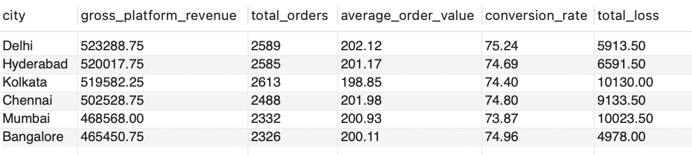

***
**Question 2:** Determine the total loss avoided through the recently launched Food-Rescue Feature.

````sql
-- Creating net_orders view for repeated use across upcoming queries

CREATE VIEW net_orders AS
SELECT 
	o.order_id,
	o.app_session_id,
	o.order_time,
    o.delivery_time,
    o.sales_quantity,
	o.payment_mode,
	o.restaurant_id,
	o.primary_product_id,
    o.delivery_agent_id,
	o.total_price,
	o.delivery_fee_paid,
	CASE 
		WHEN c.order_id IS NULL THEN 'Completed'
		WHEN c.food_rescue_availed = 'Yes' THEN 'Food Rescue Availed'
		ELSE 'Cancelled'
	END AS order_status,
	CASE 
		WHEN c.order_id IS NULL THEN (0.25 * o.total_price) + o.delivery_fee_paid
		ELSE 0 
	END AS gross_platform_revenue_per_order,
	CASE 
		WHEN c.order_id IS NULL THEN 0
		WHEN c.food_rescue_availed = 'Yes' THEN 0.50 * (o.total_price + delivery_fee_paid)
		ELSE o.total_price + o.delivery_fee_paid
	END AS loss_per_order
FROM orders AS o 
LEFT JOIN (
    SELECT 
        order_id,
        MAX(food_rescue_availed) AS food_rescue_availed
    FROM order_items_cancelled
    GROUP BY order_id
) AS c
ON o.order_id = c.order_id;

SELECT 
	CASE 
		WHEN order_time < '2024-11-01' THEN 'Pre Food Rescue Feature'
		WHEN order_time >= '2024-11-01' THEN 'Post Food Rescue Feature'
		ELSE 'error'
    END AS time_frame,
    SUM(CASE 
			WHEN order_status = 'Cancelled' THEN (total_price + delivery_fee_paid)
			WHEN order_status = 'Food Rescue Availed' THEN (total_price + delivery_fee_paid) * 0.50
			ELSE 0 
		END) AS total_loss,
    SUM(CASE
		WHEN order_status = 'Food Rescue Availed' THEN (total_price + delivery_fee_paid) * 0.50
        ELSE 0 END
        ) AS total_loss_avoided,
	ROUND((SUM(CASE WHEN order_status = 'Food Rescue Availed' THEN (total_price + delivery_fee_paid) * 0.50 END) /
		SUM(CASE WHEN order_status IN ('Cancelled','Food Rescue Availed') THEN total_price + delivery_fee_paid END))* 100, 2) AS pct_loss_avoided
FROM net_orders
GROUP BY time_frame;
````

**Walkthrough:**

- Bucketed orders into Pre/Post feature launch using a date-based `CASE` on `order_time`.
- Calculated `total_loss` (Cancelled = 100%, Rescue = 50%) and `total_loss_avoided` (recovered 50%) via conditional aggregation.
- Derived `pct_loss_avoided` over potential loss from Cancelled + Rescued and grouped by `time_frame`

**Answer 2:**

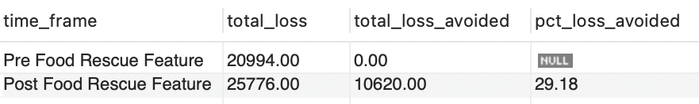

***
**Question 3:** Compute monthly orders and platform revenue with 3-month rolling totals and MoM% change to assess trends and highlight spikes/dips.

````sql
SELECT 
	YEAR(order_time) AS year,
	MONTH(order_time) AS month,
	COUNT(order_id) AS order_count,
    ROUND(((COUNT(order_id) - 
		LAG(COUNT(order_id)) OVER (ORDER BY YEAR(order_time) ASC, MONTH(order_time) ASC)) / 
			LAG(COUNT(order_id)) OVER (ORDER BY YEAR(order_time) ASC, MONTH(order_time) ASC))* 100, 2) AS mom_order_pct,
	SUM(COUNT(order_id)) OVER (ORDER BY YEAR(order_time) ASC, MONTH(order_time) ASC ROWS BETWEEN 2 PRECEDING AND CURRENT ROW) AS rolling_3m_orders,
	SUM(gross_platform_revenue_per_order) AS monthly_revenue,
    ROUND(((SUM(gross_platform_revenue_per_order) - 
		LAG(SUM(gross_platform_revenue_per_order)) OVER (ORDER BY YEAR(order_time) ASC, MONTH(order_time) ASC)) / 
			LAG(SUM(gross_platform_revenue_per_order)) OVER (ORDER BY YEAR(order_time) ASC, MONTH(order_time) ASC))* 100, 2) AS mom_revenue_pct,
	SUM(SUM(gross_platform_revenue_per_order)) OVER (ORDER BY YEAR(order_time) ASC, MONTH(order_time) ASC ROWS BETWEEN 2 PRECEDING AND CURRENT ROW) AS rolling_3m_revenue
FROM net_orders
WHERE order_status = 'Completed'
	AND NOT (YEAR(order_time) = 2025 AND MONTH(order_time) = 7)
GROUP BY year, month;
````

**Walkthrough:**

- Grouped completed orders by `YEAR/MONTH(order_time)` and excluded the partial July 2025 month.
- Calculated MoM% for orders and revenue using `LAG()` window function.
- Computed rolling 3-month totals via `SUM(...) OVER (ROWS BETWEEN 2 PRECEDING AND CURRENT ROW)`.

**Answer 3:**

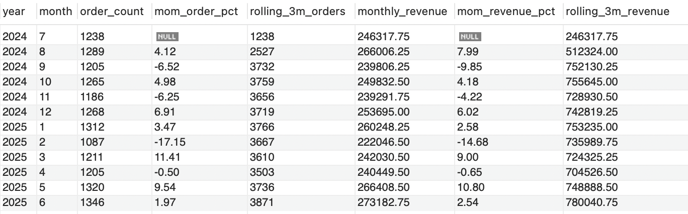

***
**Question 4:** Evaluate MOM% change in active purchasing users for the last three months and forecast for the next two months.

````sql
CREATE TEMPORARY TABLE last_3_month_active_users
SELECT 
	COUNT(DISTINCT CASE WHEN order_month = 3 THEN user_id ELSE NULL END) AS mar_2025_users,
    COUNT(DISTINCT CASE WHEN order_month = 4 THEN user_id ELSE NULL END) AS apr_2025_users,
    ROUND(((COUNT(DISTINCT CASE WHEN order_month = 4 THEN user_id ELSE NULL END) - 
				COUNT(DISTINCT CASE WHEN order_month = 3 THEN user_id ELSE NULL END)) / 
						COUNT(DISTINCT (CASE WHEN order_month = 3 THEN user_id ELSE NULL END)))* 100, 2) AS apr_mom_change_rate,
	COUNT(DISTINCT CASE WHEN order_month = 5 THEN user_id ELSE NULL END) AS may_2025_users,
	ROUND(((COUNT(DISTINCT CASE WHEN order_month = 5 THEN user_id ELSE NULL END) - 
				COUNT(DISTINCT CASE WHEN order_month = 4 THEN user_id ELSE NULL END)) / 
						COUNT(DISTINCT CASE WHEN order_month = 4 THEN user_id ELSE NULL END))* 100, 2) AS may_mom_change_rate,
	COUNT(DISTINCT CASE WHEN order_month = 6 THEN user_id ELSE NULL END) AS jun_2025_users,
    ROUND(((COUNT(DISTINCT CASE WHEN order_month = 6 THEN user_id ELSE NULL END) - 
				COUNT(DISTINCT CASE WHEN order_month = 5 THEN user_id ELSE NULL END)) / 
						COUNT(DISTINCT CASE WHEN order_month = 5 THEN user_id ELSE NULL END))* 100, 2) AS jun_mom_change_rate
FROM
(SELECT 
	u.user_id,
    n.order_id,
    YEAR(n.order_time) AS order_year,
    MONTH(n.order_time) AS order_month
FROM users AS u
LEFT JOIN app_sessions AS a
	ON u.user_id = a.user_id
LEFT JOIN net_orders AS n
	ON a.app_session_id = n.app_session_id
WHERE n.order_id IS NOT NULL
	AND YEAR(n.order_time) = '2025'
	AND MONTH(n.order_time) IN (3, 4, 5, 6)) monthly_users;

-- 3 Months Average MOM% = (-0.93% + 8.08% + 1.57%) / 3 = +2.91% 
-- 3 Months Weighted MOM% = (-.93% * 1 + 8.08% * 2 + 1.57% * 3) / 1+2+3 = +3.32% 

-- Prediction for July 2025 = 1168 + 2.91% = 1202 & 1168 + 3.32% = 1207 
	-- July 2025 = 1202 (simple) - 1207 (weighted) active users
-- Prediction for August 2025 = 1202 + 2.91% = 1237 & 1207 + 3.32% = 1247
	-- August 2025 = 1237 (simple) - 1247 (weighted) active users
   
WITH mom_change_averages AS(
		SELECT 
			(apr_mom_change_rate + may_mom_change_rate + jun_mom_change_rate) / 3 AS simple_average_mom,
			((apr_mom_change_rate * 1) + (may_mom_change_rate * 2) + (jun_mom_change_rate * 3)) / 6 AS weighted_average_mom,
            jun_2025_users AS base_month_users
		FROM last_3_month_active_users)
SELECT 
	ROUND(base_month_users * (100 + simple_average_mom)/ 100, 0) AS july_2025_simple_forecast,
    ROUND(base_month_users * (100 + weighted_average_mom)/ 100, 0) AS july_2025_weighted_forecast,
    ROUND(base_month_users * POWER((100 + simple_average_mom)/ 100, 2), 0) AS august_2025_simple_forecast,
    ROUND(base_month_users * POWER((100 + weighted_average_mom)/ 100, 2), 0) AS august_2025_weighted_forecast
FROM mom_change_averages;
````

**Walkthrough:**

- Computed March to June 2025 monthly active users in `monthly_users` subquery, further stored distinct users/month and MoM% in temporary table `last_3_month_active_users`.
- Used CTE `mom_change_averages` to derive simple/weighted average MoM% and set June users as the base.
- Forecasted July/August with `ROUND` and `POWER` (two-step growth).

**Answer 4:**

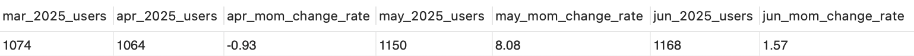
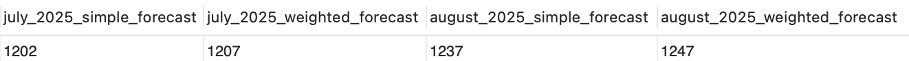

***
**Question 5:** Compare sessions, gross platform revenue, orders, revenue per sessions, and conversion rates across utm_source to evaluate paid, brand‑driven, and organic user behavior.

````sql
SELECT 
	CASE 
		WHEN a.utm_source IN ('facebook', 'instagram', 'google') THEN 'paid_traffic'
		WHEN a.utm_source IN ('email', 'notification') THEN 'brand_driven'
		ELSE 'organic'
	END AS traffic_source,
    COUNT(DISTINCT a.app_session_id) AS total_sessions,
    SUM(gross_platform_revenue_per_order) AS gross_platform_revenue,
    COUNT(DISTINCT CASE WHEN n.order_status = 'Completed' THEN n.order_id ELSE NULL END) AS total_orders,
    ROUND(SUM(gross_platform_revenue_per_order) /
		COUNT(DISTINCT a.app_session_id), 2) AS revenue_per_session,
    ROUND((COUNT(DISTINCT CASE WHEN n.order_status = 'Completed' THEN n.order_id ELSE NULL END) / 
		COUNT(DISTINCT a.app_session_id)) * 100, 2) AS conversion_rate
FROM app_sessions AS a
LEFT JOIN net_orders AS n
	ON a.app_session_id = n.app_session_id 
GROUP BY traffic_source
ORDER BY gross_platform_revenue DESC;
````

**Walkthrough:**

- Bucketed utm_source into paid_traffic/ brand_driven /organic via `CASE`.
- `LEFT JOIN`-ed sessions with `net_orders`, applied conditional aggregation (`COUNT DISTINCT … CASE …`) and rounded with `ROUND`.
- Ordered by `gross_platform_revenue` `DESC` to list top-contributing traffic sources.

**Answer 5:** 
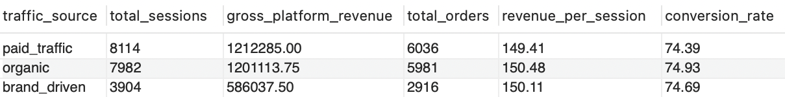

***

## Operational Efficiency, UX Funnel & Delivery Optimisation (Question 6 to 10)

**Question 6:** Measure pageview funnel performance by reporting session counts and conversion percentages at each stage to identify app abandonment patterns.

````sql
CREATE TEMPORARY TABLE sessions_with_pageviews
SELECT 
	app_session_id,
    MAX(home_page) AS viewed_home,
    MAX(search_page) AS viewed_search,
    MAX(restaurants_page) AS viewed_restaurants,
    MAX(menu_page) AS viewed_menu,
    MAX(cart_page) AS viewed_cart
FROM
(SELECT 
	app_session_id,
    CASE WHEN pageview_url = '/home-page' THEN 1 ELSE 0 END AS home_page,
    CASE WHEN pageview_url = '/search' THEN 1 ELSE 0 END AS search_page,
    CASE WHEN pageview_url = '/restaurants' THEN 1 ELSE 0 END AS restaurants_page,
    CASE WHEN pageview_url = '/menu' THEN 1 ELSE 0 END AS menu_page,
    CASE WHEN pageview_url = '/cart' THEN 1 ELSE 0 END AS cart_page
FROM app_pageviews) page_viewership
GROUP BY 1;

SELECT 
	SUM(s.viewed_home) AS homepage_sessions,
    SUM(s.viewed_search) AS to_search,
    ROUND((SUM(s.viewed_search) / 
		SUM(s.viewed_home))* 100, 2) AS pct_to_search,
    SUM(s.viewed_restaurants) AS to_restaurants,
    ROUND((SUM(s.viewed_restaurants) / 
		SUM(s.viewed_search))* 100, 2) AS pct_to_restaurants,
    SUM(s.viewed_menu) AS to_menu,
    ROUND((SUM(s.viewed_menu) / 
		SUM(s.viewed_restaurants))* 100, 2) AS pct_to_menu,
    SUM(s.viewed_cart) AS to_cart,
    ROUND((SUM(s.viewed_cart) / 
		SUM(s.viewed_menu))* 100, 2) AS pct_to_cart,
    COUNT(DISTINCT CASE WHEN n.order_status = 'Completed' THEN n.order_id ELSE NULL END) AS placed_orders,
    ROUND((COUNT(DISTINCT CASE WHEN n.order_status = 'Completed' THEN n.order_id ELSE NULL END) / 
		SUM(s.viewed_cart))* 100, 2) AS pct_placed_orders
FROM sessions_with_pageviews AS s
LEFT JOIN net_orders AS n
	ON s.app_session_id = n.app_session_id;
````

**Walkthrough:**

- Built stage flags in a subquery using `CASE` per `pageview_url`, aggregated to per-session flags in temporary table `sessions_with_pageviews` via `MAX`.
- Aggregated stage reach and computed step-to-step conversion percentages across the funnel.
- `LEFT JOIN`-ed `net_orders` to count Completed orders and derive cart to order conversion.

**Answer 6:**
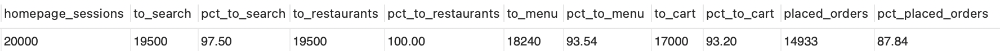

***
**Question 7:** Assess how cart size impacts delivery performance, compare average delivery time, delivery fee, and delivery-fee share of GMV across order size buckets.

````sql
SELECT 
	CASE
		WHEN sales_quantity = 1 THEN 'Single Item'
        WHEN sales_quantity BETWEEN 2 AND 4 THEN 'Medium Size Cart'
        WHEN sales_quantity >= 5 THEN 'Big Cart'
        ELSE 'Error'
	END AS order_cart_size,
    ROUND(AVG(TIMESTAMPDIFF(MINUTE, order_time, delivery_time)), 0) AS average_delivery_time,
    ROUND(AVG(delivery_fee_paid), 2) AS average_delivery_fee,
    ROUND((SUM(delivery_fee_paid) /
		SUM(total_price + delivery_fee_paid))* 100, 2) AS delivery_fee_pct_of_gmv
FROM net_orders
WHERE order_status = 'Completed'
GROUP BY order_cart_size;
````

**Walkthrough:**

- Bucketed `sales_quantity` into Single Item/ Medium Size Cart/ Big Size Cart via `CASE`.
- Calculated `AVG(TIMESTAMPDIFF(order_time, delivery_time))` and `AVG(delivery_fee_paid)` per bucket.
- Derived `delivery_fee_pct_of_gmv` as `SUM(delivery_fee_paid) / SUM(total_price + delivery_fee_paid)` for completed orders only.

**Answer 7:**

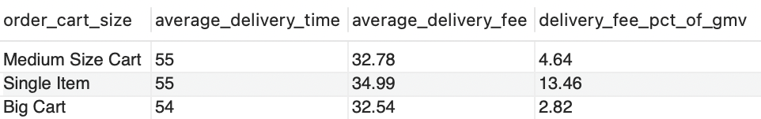

***
**Question 8:** Evaluate device-based performance by reporting total sessions, completed orders, order conversion rate, cart abandonment rate and revenue per session across platforms.

````sql
SELECT 
	a.device_type,
    COUNT(DISTINCT a.app_session_id) AS total_sessions,
    COUNT(DISTINCT CASE WHEN n.order_status = 'Completed' THEN n.order_id ELSE NULL END) AS total_orders,
    ROUND((COUNT(DISTINCT CASE WHEN n.order_status = 'Completed' THEN n.order_id ELSE NULL END) /
		COUNT(DISTINCT a.app_session_id))* 100, 2) AS conversion_rate,
    ROUND(((COUNT(DISTINCT CASE WHEN cart_pv.app_session_id IS NOT NULL THEN cart_pv.app_session_id END) - 
		COUNT(DISTINCT CASE WHEN n.order_status = 'Completed' THEN n.order_id ELSE NULL END)) /
			COUNT(DISTINCT CASE WHEN cart_pv.app_session_id IS NOT NULL THEN cart_pv.app_session_id END))* 100, 2) AS cart_abandonment_rate,
	ROUND(SUM(gross_platform_revenue_per_order) /
		COUNT(DISTINCT a.app_session_id), 2) AS revenue_per_session
FROM app_sessions AS a
LEFT JOIN net_orders AS n
	ON a.app_session_id = n.app_session_id
LEFT JOIN (SELECT
				DISTINCT app_session_id
		  FROM app_pageviews
          WHERE pageview_url = '/cart') AS cart_pv
ON a.app_session_id = cart_pv.app_session_id
GROUP BY a.device_type;
````

**Walkthrough:**


- Identified cart-reached sessions with the `cart_pv` subquery.
- Further joined with `app_sessions` and `net_orders`.
- Computed per-device sessions, completed orders, conversion, cart abandonment `((cart − orders) / cart)`, and revenue per session.

**Answer 8:**

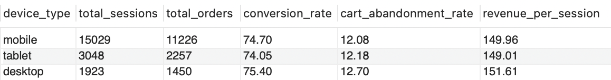

***
**Question 9:** Identify and rank the busiest hours across the week, with a weekday breakdown to optimise staffing and resource allocation for Zomato’s live customer support.

````sql
SELECT 
	DENSE_RANK() OVER (ORDER BY SUM(no_of_sessions) DESC) AS busiest_hour_ranking,
	SUM(no_of_sessions) AS total_sessions,
	hour,
    SUM(CASE WHEN weekday = 2 THEN no_of_sessions END) AS monday,
	SUM(CASE WHEN weekday = 3 THEN no_of_sessions END) AS tuesday,
	SUM(CASE WHEN weekday = 4 THEN no_of_sessions END) AS wednesday,
	SUM(CASE WHEN weekday = 5 THEN no_of_sessions END) AS thursday,
	SUM(CASE WHEN weekday = 6 THEN no_of_sessions END) AS friday,
	SUM(CASE WHEN weekday = 7 THEN no_of_sessions END) AS saturday,
    SUM(CASE WHEN weekday = 1 THEN no_of_sessions END) AS sunday
FROM(
SELECT 
    DAYOFWEEK(created_at) AS weekday,
    HOUR(created_at) AS hour,
    COUNT(DISTINCT app_session_id) AS no_of_sessions
FROM app_sessions
GROUP BY weekday, hour) weekly_hourly_sessions
GROUP BY hour
ORDER BY hour ASC;
````

**Walkthrough:**

- Bucketed sessions by weekday and hour using `DAYOFWEEK()` and `HOUR()`.
- Organized weekdays with `SUM(CASE …)` and computed total sessions per hour (weekday columns + hourly total).
- Ranked hours by total_sessions with `DENSE_RANK()` to identify the busiest hours.


**Answer 9:**

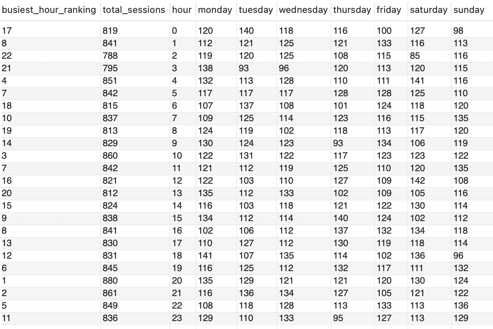

***
**Question 10:** Identify the count of delivery agents whose completed delivery volumes fall within the bottom 25% among all riders, to evaluate under-utilisation rates.

````sql
WITH ranked_delivery_count AS(
		SELECT
			DENSE_RANK() OVER (ORDER BY COUNT(DISTINCT n.order_id) ASC) AS count_rank,
            d.delivery_agent_id,
            COUNT(DISTINCT n.order_id) AS deliveries_done
		FROM delivery_agents AS d
        LEFT JOIN net_orders AS n
			ON d.delivery_agent_id = n.delivery_agent_id
		WHERE n.order_status IN ('Completed', 'Food Rescue Availed')
        GROUP BY d.delivery_agent_id),
     p25_rank_threshold AS(
		SELECT 
			0.25 * MAX(count_rank) AS threshold
		FROM ranked_delivery_count)
SELECT 
	COUNT(DISTINCT CASE WHEN count_rank <= threshold THEN delivery_agent_id ELSE NULL END) AS riders_below_p25_count,
	ROUND((COUNT(DISTINCT CASE WHEN count_rank <= threshold THEN delivery_agent_id ELSE NULL END) / 
		COUNT(DISTINCT delivery_agent_id))* 100, 2) AS under_utilisation_rate
FROM ranked_delivery_count
CROSS JOIN p25_rank_threshold;
````

**Walkthrough:**

- Built CTE `ranked_delivery_count` to count deliveries per rider (Completed + Rescued) and assign `DENSE_RANK()` `ASC`.
- Evaluated the 25th-percentile cutoff in `p25_rank_threshold` as `0.25 * MAX(count_rank)`.
- Computed riders with count_rank ≤ threshold and their percentage of all riders.


**Answer 10:**

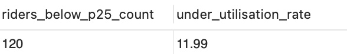

***

## Customer, Product & Restaurant Partner Level Analytics (Question 11 to 17)

**Question 11:** Determine the distribution of users by purchase frequency and engagement level to identify behavioral trends.

````sql
WITH order_and_session_count AS(
	SELECT 
		u.user_id,
		COUNT(DISTINCT CASE WHEN order_status = 'Completed' THEN n.order_id ELSE NULL END) AS order_count,
		COUNT(DISTINCT a.app_session_id) AS session_count
	FROM users AS u
	LEFT JOIN app_sessions AS a
		ON u.user_id = a.user_id
	LEFT JOIN net_orders AS n
		ON a.app_session_id = n.app_session_id
	GROUP BY u.user_id)
SELECT 
	CASE 
		WHEN order_count = 0 THEN 'No Orders' 
		WHEN order_count = 1 THEN 'Single Order' 
		WHEN order_count BETWEEN 2 AND 4 THEN 'Occasional'
		WHEN order_count >= 5 THEN 'Regular'
        ELSE 'Error'
	END AS user_purchase_frequency, 
	CASE 
		WHEN session_count = 0 THEN 'Inactive'
		WHEN session_count BETWEEN 1 AND 3 THEN 'Low Engagement'
		WHEN session_count BETWEEN 4 AND 6 THEN 'Medium Engagement'
		WHEN session_count >= 7 THEN 'High Engagement'
		ELSE 'Error'
    END AS user_engagement_behaviour,
COUNT(DISTINCT user_id) AS no_of_users
FROM order_and_session_count
GROUP BY user_purchase_frequency, user_engagement_behaviour;
````

**Walkthrough:**

- Summarised completed orders and total sessions per user via CTE `order_and_session_count`
- Categorised purchase frequency and engagement via `CASE`.
- `GROUP BY` both categories and `COUNT DISTINCT(user_id)` to size each segment.

**Answer 11:**

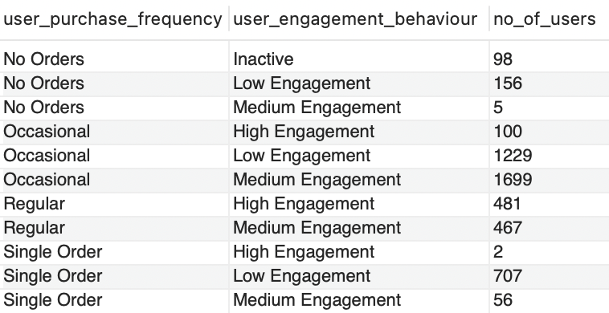

***
**Question 12:** Conduct RFM analysis for all customers and rank them based on monetary value.

````sql
SELECT 
	RANK() OVER (ORDER BY SUM(n.gross_platform_revenue_per_order) DESC) AS ranking,
	u.user_id,
    u.name,
    u.gold_member,
    MAX(DATE(n.order_time)) AS last_order_placed, -- Recency (R)
    COUNT(DISTINCT n.order_id) AS frequency, -- Frequency (F)
    SUM(n.gross_platform_revenue_per_order) AS platform_clv, -- Monetary Value (M)
    SUM(n.total_price + n.delivery_fee_paid) AS total_spent -- Total Spent
FROM users AS u
LEFT JOIN app_sessions AS a
	ON u.user_id = a.user_id
LEFT JOIN net_orders AS n
	ON a.app_session_id = n.app_session_id
WHERE n.order_status = 'Completed'
GROUP BY u.user_id, u.name, u.gold_member
ORDER BY platform_clv DESC;
````

**Walkthrough:**

- Joined `users` → `app_sessions` → `net_orders` and filtered to Completed orders.
- Computed R/F/M: Recency `MAX(DATE(order_time))`, Frequency `COUNT DISTINCT(order_id)`, Monetary `SUM(gross_platform_revenue_per_order)`, also evaluating total_spent.
- Ranked users by Monetary with `RANK() OVER (ORDER BY SUM(...) DESC)` and ordered the output by platform CLV.

**Answer 12:**

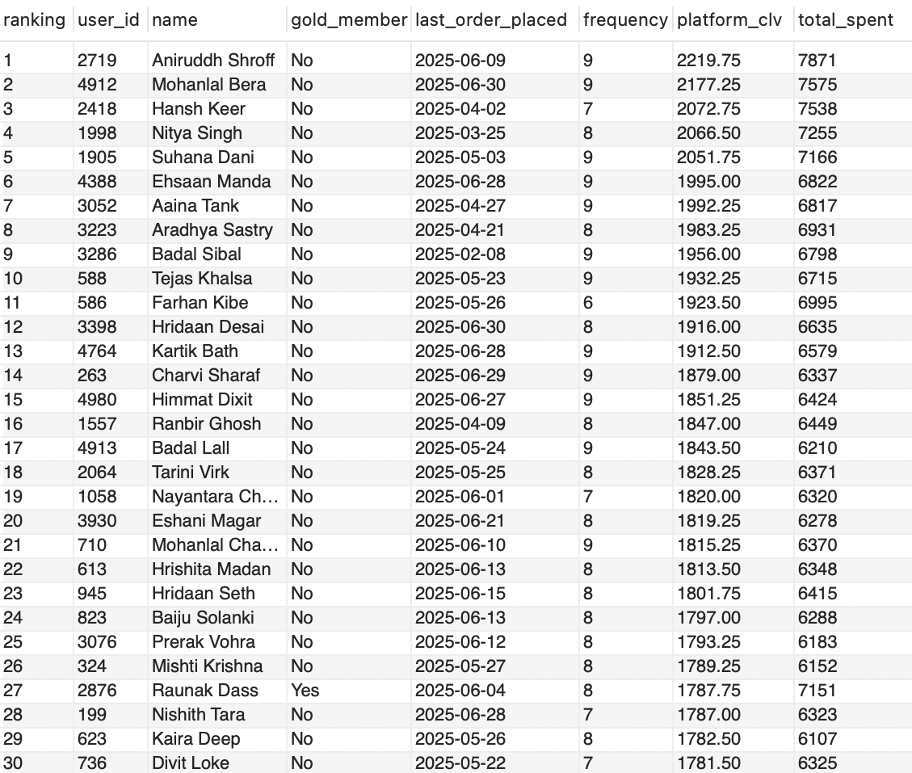

***
**Question 13:** Calculate how order volume, items per completed and cancelled order, and cancellation rates differ for Gold vs. Non-Gold Members.

````sql
WITH items_per_order AS(
		SELECT 
			order_id,
            SUM(quantity) AS items_count
		FROM order_items
        GROUP BY order_id)
SELECT 
	CASE 
		WHEN u.gold_member = 'Yes' THEN 'Gold Members'
		ELSE 'Non-Gold Members'
    END AS membership_status,
	COUNT(DISTINCT CASE WHEN n.order_status = 'Completed' THEN n.order_id ELSE NULL END) AS completed_orders,
	ROUND(SUM(CASE WHEN n.order_status = 'Completed' THEN i.items_count ELSE 0 END) /
		COUNT(DISTINCT CASE WHEN n.order_status = 'Completed' THEN n.order_id ELSE NULL END), 2) AS items_per_completed_order,
	ROUND((COUNT(DISTINCT CASE WHEN n.order_status IN ('Cancelled', 'Food Rescue Availed') THEN n.order_id ELSE NULL END) /
		COUNT(DISTINCT n.order_id))*100, 2) AS cancellation_rate,
	ROUND(SUM(CASE WHEN n.order_status IN ('Cancelled', 'Food Rescue Availed') THEN i.items_count ELSE 0 END) /
		COUNT(DISTINCT CASE WHEN n.order_status IN ('Cancelled', 'Food Rescue Availed') THEN n.order_id ELSE NULL END), 2) AS items_per_cancelled_order
FROM users AS u
LEFT JOIN app_sessions AS a
	ON u.user_id = a.user_id
LEFT JOIN net_orders AS n
	ON a.app_session_id = n.app_session_id
LEFT JOIN items_per_order AS i
	ON n.order_id = i.order_id 
GROUP BY membership_status;
````

**Walkthrough:**

- Aggregated items per order in CTE `items_per_order` `(SUM(quantity) by order_id)`.
- `LEFT JOIN` -ed `users` → `app_sessions` → `net_orders` → `items_per_order`, grouped by membership via `CASE` on gold_member.
- Computed completed orders, items per completed order, cancellation rate, and items per cancelled/rescued order using conditional aggregation (`COUNT DISTINCT`, `SUM`).

**Answer 13:**

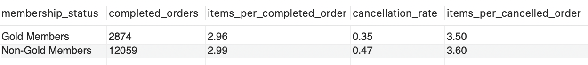

***
**Question 14:** Measure the distribution of completed orders across value segments and evaluate how Zomato Wallet usage varies in count and percentage within each segment.

````sql
SELECT 
	CASE 
		WHEN total_price + delivery_fee_paid <= 300 THEN 'Low Value Order'
		WHEN total_price + delivery_fee_paid BETWEEN 301 AND 600 THEN 'Standard Value Order'
		WHEN total_price + delivery_fee_paid BETWEEN 601 AND 900 THEN 'High Value Order'
		WHEN total_price + delivery_fee_paid > 900 THEN 'Mega Value Order'
		END AS order_value_type,
	COUNT(DISTINCT order_id) AS completed_orders,
	COUNT(DISTINCT CASE WHEN payment_mode = 'Wallet' THEN order_id ELSE NULL END) AS orders_paid_using_wallet,
	ROUND((COUNT(DISTINCT CASE WHEN payment_mode = 'Wallet' THEN order_id ELSE NULL END) /
		COUNT(DISTINCT order_id))* 100, 2) AS pct_paid_using_wallet
FROM net_orders
WHERE order_status = 'Completed'
GROUP BY order_value_type
ORDER BY completed_orders DESC;
````

**Walkthrough:**

- Banded (`total_price` + `delivery_fee_paid`) into Low/ Standard/ High/ Mega via `CASE`.
- Filtered to `order_status = 'Completed'`, counted total vs wallet-paid orders per band (conditional `COUNT DISTINCT`).
- Computed wallet share (%) using per band under pct_paid_using_wallet and ordered by completed_orders `DESC`.

**Answer 14:**

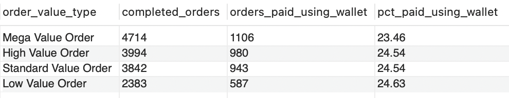

***
**Question 15:** Identify the top 3 restaurants in each city, ranked by their contribution to both city-level and national-level platform commission and order volume.

````sql
WITH national_totals AS( 
		SELECT
			SUM(0.25 * total_price) AS national_commission_total,
            COUNT(DISTINCT order_id) AS national_order_total
		FROM net_orders
        WHERE order_status = 'Completed'),
     city_totals AS(
		SELECT
			r.city,
            SUM(0.25 * n.total_price) AS city_commission_total,
            COUNT(DISTINCT n.order_id) AS city_order_total
		FROM net_orders AS n
        LEFT JOIN restaurants AS r
			ON n.restaurant_id = r.restaurant_id 
		WHERE n.order_status = 'Completed'
        GROUP BY r.city),
     restaurant_totals AS(
		SELECT
        r.city,
        r.restaurant_id,
        SUM(0.25 * total_price) AS restaurant_commission_total,
		COUNT(DISTINCT order_id) AS restaurant_order_total
        FROM net_orders AS n
        LEFT JOIN restaurants AS r
			ON n.restaurant_id = r.restaurant_id
		WHERE n.order_status = 'Completed'
        GROUP BY r.city, r.restaurant_id),
     performance AS(
		SELECT
			r.city,
			r.restaurant_id,
            ROUND((r.restaurant_commission_total /
				c.city_commission_total)* 100, 2) AS city_commission_share_pct,
            ROUND((r.restaurant_commission_total / 
				n.national_commission_total)* 100, 2) AS national_commission_share_pct,
			ROUND((r.restaurant_order_total /
				c.city_order_total)* 100, 2) AS city_order_share_pct,
            ROUND((r.restaurant_order_total /
				n.national_order_total)* 100, 2) AS national_order_share_pct
		FROM restaurant_totals AS r
        LEFT JOIN city_totals AS c
			ON r.city = c.city
		CROSS JOIN national_totals AS n),
     restaurant_ranking AS(
		SELECT 
			city,
			ROW_NUMBER() OVER (PARTITION BY city ORDER BY city_commission_share_pct DESC, national_commission_share_pct DESC) AS city_wise_rank,
			restaurant_id,
			city_commission_share_pct,
			national_commission_share_pct,
			city_order_share_pct,
			national_order_share_pct
		FROM performance)
SELECT
	city,
	city_wise_rank,
	restaurant_id,
	city_commission_share_pct,
	national_commission_share_pct,
	city_order_share_pct,
	national_order_share_pct
FROM restaurant_ranking
WHERE city_wise_rank <= 3;
````

**Walkthrough:**

- Computed commission and orders contribution nationally via `national_totals`, regionally via `city_totals`, and individually via `restaurant_totals`, then calculated share percentages in the `performance` CTE.
- Ranked restaurants within each city using `ROW_NUMBER() PARTITION BY city`.
- Returned the top 3 per city with `WHERE city_wise_rank <= 3`.

**Answer 15:**


***
**Question 16:** List the top 10 highest‑rated restaurants with review counts above the overall average.

````sql
SELECT
	ROW_NUMBER() OVER (ORDER BY rating DESC, number_of_reviews DESC) AS ranking, 
	restaurant_id, 
    cuisine,
    city,
    rating,
    number_of_reviews
FROM restaurants
WHERE number_of_reviews > 
(SELECT 
	AVG(number_of_reviews)
FROM restaurants)
LIMIT 10;   
````

**Walkthrough:**

- Computed the platform-wide `AVG(number_of_reviews)` via a scalar subquery.
- Filtered restaurants above that benchmark using `WHERE`.
- Ranked with `ROW_NUMBER (by rating DESC, then number_of_reviews DESC)` and shortlisted the top 10 via `LIMIT`.

**Answer 16:**

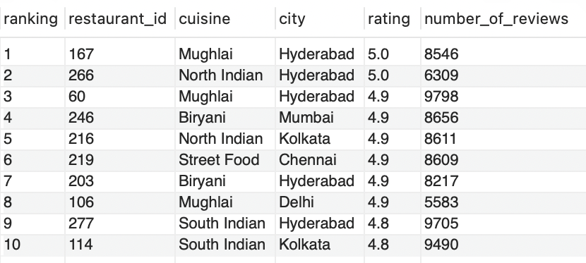

***
**Question 17:** Identify the top 10 meal pairings by purchase frequency to optimise targeted cross-sell recommendations.

````sql
CREATE TEMPORARY TABLE primary_product_per_order
SELECT 
	n.order_id,
    n.primary_product_id,
    m.fooditem_name AS primary_product
FROM net_orders AS n
LEFT JOIN menu AS m
	ON n.primary_product_id = m.food_item_id
WHERE order_status = 'Completed';

SELECT 
	LEAST(p.primary_product, m.fooditem_name) AS combo_item_1,
    GREATEST(p.primary_product, m.fooditem_name) AS combo_item_2,
    COUNT(DISTINCT p.order_id) AS combo_order_count
FROM primary_product_per_order AS p
LEFT JOIN order_items AS o
	ON p.order_id = o.order_id
    AND o.is_primary_item = 'No'
LEFT JOIN menu AS m
	ON o.food_item_id = m.food_item_id
WHERE o.food_item_id <> p.primary_product_id
GROUP BY combo_item_1, combo_item_2
ORDER BY combo_order_count DESC
LIMIT 10;
````

**Walkthrough:**

- Summarised each completed order’s primary product (id + name) via a menu join in `primary_product_per_order`.
- Further joined non-primary order_items and menu to list pairs, then standardised pairs consistently with `LEAST/GREATEST`.
- Counted `DISTINCT order_id` per pair, ordered by frequency, and limited to the top 10 combos.

**Answer 17:**

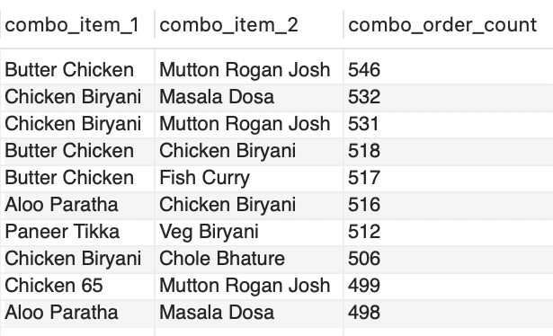

***

Access the SQL script file [zomato_sql_script](https://github.com/pragun25/Zomato-Data-Analysis-SQL/blob/main/zomato_sql_script.sql) <br>
Access the dataset [zomato_dataset](https://github.com/pragun25/Zomato-Data-Analysis-SQL/tree/main/zomato_dataset)
